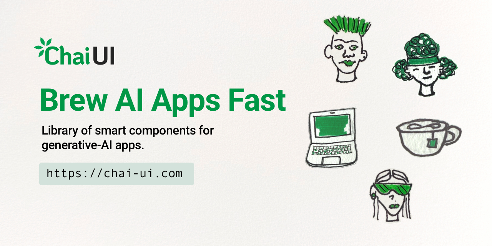

<p align="center">
  <a href="https://chai-ui.com"></a>
</p>

<p align="center">
  <a href="https://github.com/kazarazat/chai-ui/actions/workflows/ci.yml"></a>
  <a href="https://codecov.io/gh/kazarazat/chai-ui"></a>
  <a href="https://www.npmjs.com/package/@chai-ui/react"></a>
  <a href="./LICENSE"></a>
  <a href="#install"></a>
</p>

# Chai UI

**A design system for AI model interactions.** Every component comes with
its use case instructions built in, takes its look from your design tokens
(Material Design 3 included), and runs on Fal.ai, OpenRouter or your own
engine.

Docs and live examples: **[chai-ui.com/docs](https://chai-ui.com/docs)**

<details>
<summary><strong>Features</strong></summary>

- **Composer:** a prompt bar with attachments, use cases, model and
  aspect-ratio menus, prompt optimization, auto-select model routing, and
  a stop button.
- **MediaAnalyzer:** drop in an image, video or audio clip and get a
  generation-ready prompt back.
- **ResultCard:** one prompt's results (image, video, audio or text), with
  like, retry, download, share, a details flip, and streaming text.
- **EditCard:** edit an image by marking regions on it, each with its own
  instruction, then page through the edits as versions.
- **Engines:** Fal.ai for media generation, OpenRouter for reasoning, or
  your own. API keys stay on your server.

</details>

## Install

```sh
pnpm add @chai-ui/react @chai-ui/core @chai-ui/tokens
```

React 18.3 and 19 are supported.

## Quick start

```tsx
import "@chai-ui/tokens/css";
import "@chai-ui/react/style.css";
import { useState } from "react";
import { ChaiProvider, Composer, ResultCard, createFalEngine, useComposer } from "@chai-ui/react";

const engine = createFalEngine();

function App() {
  const [value, setValue] = useState("");
  const { run, submit, cancel } = useComposer({ engine });
  const busy = run?.results.some((r) => r.status === "queued" || r.status === "running") ?? false;

  return (
    <>
      <Composer value={value} onChange={setValue} onSubmit={submit} submitting={busy} onAbort={cancel} />
      {run && <ResultCard results={run.results} prompt={run.request.prompt} onAction={() => {}} />}
    </>
  );
}

export default function Root() {
  return (
    <ChaiProvider>
      <App />
    </ChaiProvider>
  );
}
```

To try it before setting up a provider, leave out `engine` and
`ChaiProvider`: everything then runs on built-in mocks, with no network
calls and no keys.

## Your API keys stay on your server

The engines call one route on your server, which adds the key. In Next.js
it's one file:

```ts
// app/api/chai/[...path]/route.ts
import { createChaiHandler } from "@chai-ui/core/server";

export const { GET, POST, PUT } = createChaiHandler();
```

Then set `FAL_KEY` and `OPENROUTER_API_KEY` on your server. React Router
(or Remix), and API servers behind a Vite + React app (Express, Hono,
Cloudflare Workers, Bun, Deno), are covered in the [`@chai-ui/core` README](./packages/core/README.md#the-server-route-chai-uicoreserver),
along with `authorize` and `allowedModels` for production.

## Packages

| Package | What it is |
|---|---|
| [`@chai-ui/react`](./packages/react) | The components and hooks |
| [`@chai-ui/core`](./packages/core) | Framework-free data model, engines and the server route |
| [`@chai-ui/tokens`](./packages/tokens) | Design tokens as CSS variables, JS and a Figma token set |

## Accessibility

Chai's components are built to support WCAG 2.2 AA, tested with axe and
automated keyboard and focus checks in a browser. See
[DESIGN.md](./packages/react/DESIGN.md#6-accessibility).

## Help and contributing

- Questions and troubleshooting: [SUPPORT.md](./SUPPORT.md)
- Bugs and ideas: [open an issue](https://github.com/kazarazat/chai-ui/issues/new/choose)
- Contributing: [CONTRIBUTING.md](./CONTRIBUTING.md)
- Security: [SECURITY.md](./SECURITY.md)

## License

[MIT](./LICENSE) © kazarazat

Illustrations © 2026 Imani Razat, used with permission. They aren't
covered by the MIT license.
